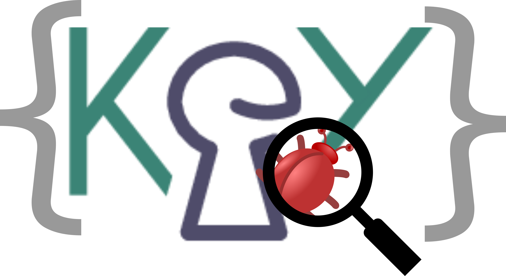

# PSDBG -- Proof Script Debugger 

The proof script debugger is a prototypical implementation of an interaction 
concept for program verification systems that are rule based and use a program 
logic. The prototype is implemented on top of the interactive program
verification system KeY. 
KeY is an interactive program verification system for Java program annotated with the Java Modeling Language (JML).

The protypical implementation includes a proof scripting language that is 
tailored to the problem domain of program verification. The main features of 
the language are:

* integration of domain specific entities like goal, formula, term and rule as first-class citizens into the language;
* an expressive proof goal selection mechanism
** to identify and select individual proof branches,
** to easily switch between proof branches,
** to select multiple branches for uniform treatment (multi-matching); that is resilient to small changes in the proof
* a repetition construct which allows repeated application of proof strategies;
* support for proof exploration within the language.

Together with the proof scripting language a debugging concept for failed 
proof attempts is implemented that leverages well-known concepts from program 
debugging to the analysis of failed proof attempts.

# About this Repository

The latest build as jar file can be downloaded here. 
Plese note that some funtionlities may not work in this jar as it is the build 
of the development version of PSDBG.