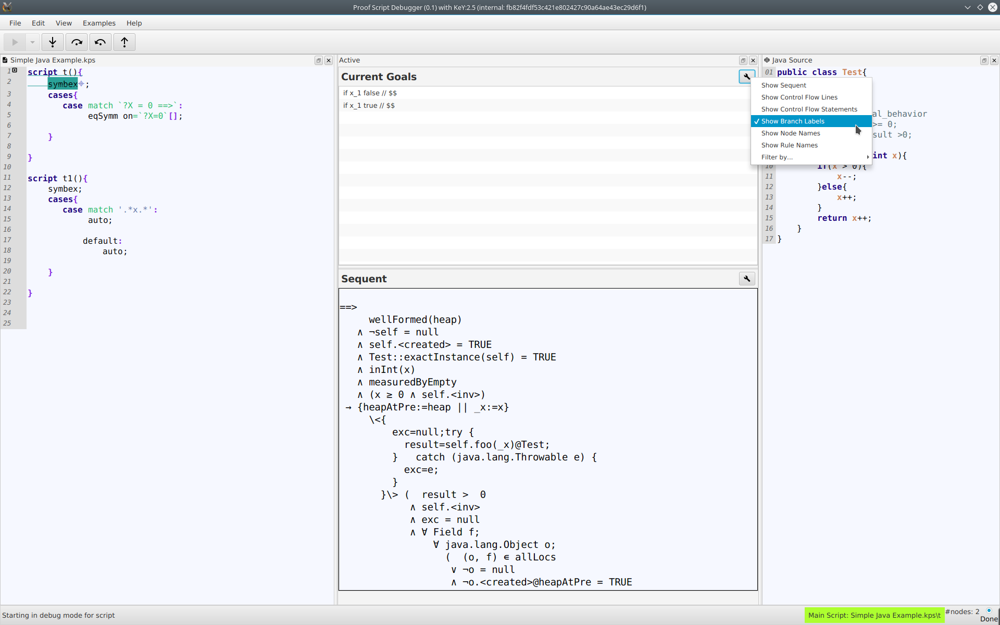
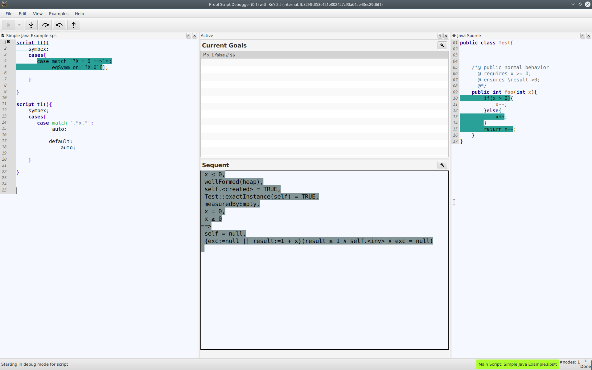
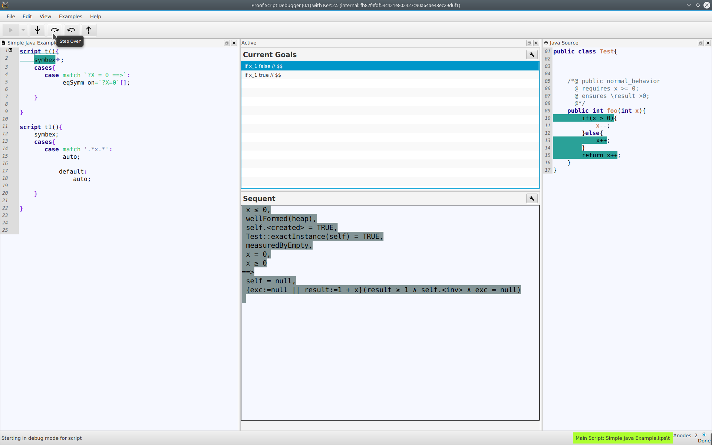

<h1>Proof Script Debugger for the KeY System</h1>

The proof script debugger is a prototypical implementation
of an interaction concept for program verification systems that are rule based and
use a program logic.
The prototype is implemented on top of the interactive program verification system
<a href="http://www.key-project.org">KeY</a>. KeY is an interactive program verification
system for Java program annotated with the Java Modeling Language (JML).

The protypical implementation includes a proof scripting language that is tailored to the
problem domain of program verification.
The main features of the language are:
<ol>
<li> integration of domain specific entities like goal, formula, term and rule as
first-class citizens into the language;</li>
<li> an expressive proof goal selection mechanism
<ul>
    <li>to identify and select individual proof branches,</li>
    <li>to easily switch between proof branches,</li>
    <li>to select multiple branches for uniform treatment (multi-matching);</li>
</ul>
that is resilient to small changes in the proof</li>
<li> a repetition construct which allows repeated application of proof strategies;</li>
<li> support for proof exploration within the language.</li>

</ol>
Together with the proof scripting language a debugging concept for failed proof attempts
is implemented that leverages well-known concepts from program debugging to
the analysis of failed proof attempts.

<h2>Publications</h2>
A full description of the language and debugging-concept is published at <a href="">HVC 2017</a>.

<h2>Features</h2>

    

        <h3>Inspection of different parts of the proof state</h3>
        
 
        The different parts of the proof state can be inspected:
        <ul>
         <li>list of open goals</li>
         <li>sequent of selected open goal</li>
         <li>path through program (if existing) for selected open goal</li>
         </ul>
        
 
    

    

        <h3>Adjustable view on list of open goals</h3>
        
    

    

        <h3>Explore the proof tree of KeY</h3>
    

    

        

            <h3>Stepwise evaluation of the proof script</h3>
            

            The proof script can be evaluated stepwise and by running to a set breakpoint.
            

        

        

            <h3>Set a breakpoint and run execution to breakpoint</h3>
             
        

        
 
            <h3> Step forward and step backward</h3>
            
        

    

    
 
    

<footer style="border-top: #ccc 1px solid">
            Contact: <a href="https://formal.iti.kit.edu/~grebing/">Sarah Grebing</a>
        </footer>
        

