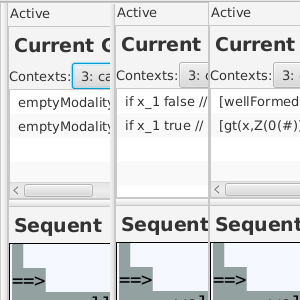
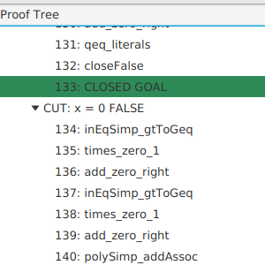
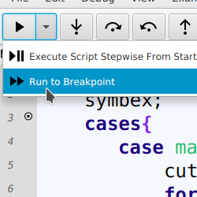
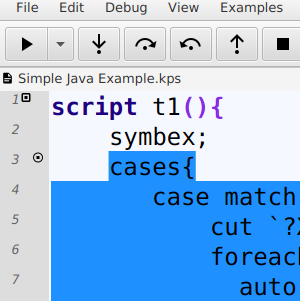
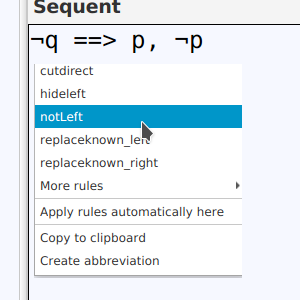

# Proof Script Debugger for the KeY System

The proof script debugger is a prototypical implementation
of an interaction concept for program verification systems that are rule based and
use a program logic.
The prototype is implemented on top of the interactive program verification system
[KeY](http://www.key-project.org). KeY is an interactive program verification
system for Java program annotated with the Java Modeling Language (JML).

The protypical implementation includes a proof scripting language that is tailored to the
problem domain of program verification.
The main features of the language are:

1. integration of domain specific entities like goal, formula, term and rule as
first-class citizens into the language;</li>
1. an expressive proof goal selection mechanism
  * to identify and select individual proof branches,
  * to easily switch between proof branches,
  * to select multiple branches for uniform treatment (multi-matching);
  that is resilient to small changes in the proof
1. a repetition construct which allows repeated application of proof strategies;</li>
1. support for proof exploration within the language.</li>

Together with the proof scripting language a debugging concept for failed proof attempts
is implemented that leverages well-known concepts from program debugging to
the analysis of failed proof attempts.

## Publications

A full description of the language and debugging-concept 
is published at [HVC 2017](http://rdcu.be/E4fF)

## Debugging Script for Quicksort's `split` method.

### Selecting the proof script

<video width="80%"  controls>
  <source src="../psdbg_videos/selection.webm" type="video/webm">
Your browser does not support the video tag.
</video>

In this video the selection of the Quicksort example from the paper is shown.
After loading the example a dialog appears in which the appropriate contract for the 
Java method `split` has to be selected. After loading the problem the program to be verified is 
shown in an own view on the right side, the script is shown on the left side and in the middle the proof obligation and the list of open goals is shown. 
Views can be selected and docked to other places on the screen.

Please note that after a succesful load the statusbar indicates that the contract was loaded.

### Setting a breakpoint and starting the Interpreter

<video width="80%"  controls>
  <source src="../psdbg_videos/breakpoint.webm" type="video/webm">
Your browser does not support the video tag or WebM.
</video>

In this video it is shown how to set a breakpoint and how to start the debugger/interpreter. Please note that if no script is set as main script the first script in the open editor is taken as main script an set. This can be seen in the status bar.
Furthermore the status of the interprter is shown with small icons in the right lower corner of the status bar. A running interpreter is indicated by a running figure. A paused interpreter is indicated by a timer. 
If the interpreter reaches the end of the proof script the status is shown as a tick.
The video does not include the full execution until the breakpoint, as executing certain proof commands may take time.

### Stepping into, over and reverse and continue

<video width="80%"  controls>
  <source src="../psdbg_videos/stepping_new.webm" type="video/webm">
Your browser does not support the video tag or WebM.
</video>

After reaching the breakpoint set in the video before, we are left with 4 open goals, visible in the goal list.
In this video the stepping functionalities are demonstrated. Stepping into proof commands of the underlying verification system
results in a view of the partial proof tree corresponding to the execution of this command.
It can also be seen to which sequents the matching expression matches. 

### Successful Proof Indication

<video width="80%"  controls>
  <source src="../psdbg_videos/proof_new.webm" type="video/webm">
Your browser does not support the video tag or WebM.
</video>

In this video the successful proof is shown and it is demonstrated how to access the full proof tree of the proof for the `split` method.

### SequentMatcher and Interactive Rule Application

<video width="80%"  controls>
  <source src="../psdbg_videos/interactive.webm" type="video/webm">
Your browser does not support the video tag or WebM.
</video>

In this video we demonstrate the interactive point and click rule applications after selecting the interactive button. We further demonstrate how the interaction is included to the original script.

<video width="80%"  controls>
  <source src="../psdbg_videos/sequentmatcher.webm" type="video/webm">
Your browser does not support the video tag or WebM.
</video>

Furthermore, we show how to use our SequentMatcher Window to enhance the auto-generated matching expressions from the 
interactive rule applications.

## Features

    

        <h3>Inspection of different parts of the proof state</h3>
        
 
        The different parts of the proof state can be inspected:
        <ul>
        <li>list of open goals</li>
        <li>sequent of selected open goal</li>
        <li>path through program (if existing) for selected open goal</li>
        </ul>
        
 
    

    

        <h3>Adjustable view on list of open goals</h3>
        
        

    

    

        <h3>Explore the proof tree of KeY</h3>
        
        

    

    

        <h3>Set a breakpoint and run execution to breakpoint</h3>
        
        

            Mark lines with an (conditional) breakpoint to pause the script execution.
        

    

    
 
        <h3>Stepwise evaluation for time travellers</h3>
        
        

            Stepwise script execution: step over and into.
            Our special offers for time travellers: Go backwards in time
            and then Back to the Future, again!
        

    

    
 
      <h3> Interactive Rule Application</h3>
        
        

        Select rules for interactive application.
        

  

 

<h2>Downloads</h2>

<ul>
 <li>PSDBG - <strong>Version 1.0.1b-FM</strong> 
    <a href="../psdbg_releases/psdbg-1.0.1b-fm.jar">psdbg-1.0.1b-fm.jar</a>
     
    Special Version for the tool paper at Formal Methods 2018.
    Including examples and all dependencies.
     
   <!-- Requires Java version 1.8.0_121 or higher -->
     
    <a href="https://www.gnu.org/licenses/gpl-3.0.txt">License: GPLv3</a>
    <a href="thirdparty.txt">Third Party Licenses</a> 
     
    Executable with <code>java -jar psdbg-1.0.1b-fm.jar</code>
 </li>
</ul>

